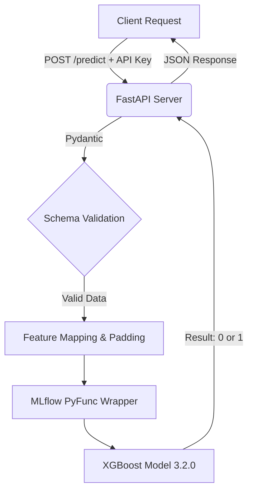

# 🛡️ Ethereum Fraud Detection MLOps Pipeline


A production-grade, hardened machine learning API designed to detect fraudulent Ethereum transactions. This project demonstrates an end-to-end MLOps workflow, taking an XGBoost model from training to a secure, containerized cloud deployment.

## 🚀 Live API
The model is currently deployed and serving predictions via Render.
**Base URL:** `https://eth-fraud-api.onrender.com`

---

## 🧠 System Architecture

The pipeline uses `MLflow` for versioning and `pyfunc` wrapping to ensure environment reproducibility between training and production. The API is secured via strict `Pydantic` schema validation and header-based API key authentication.



---

## 🛠️ Tech Stack
* **Modeling:** XGBoost, Scikit-Learn, Pandas
* **MLOps & Tracking:** MLflow (`pyfunc` flavor)
* **API Serving:** FastAPI, Uvicorn, Pydantic
* **Containerization:** Docker
* **Deployment:** Render

---

## 📡 API Usage (Live Demo)

To test the live prediction engine, send a POST request to the `/predict` endpoint. 

**Note:** This endpoint is secured. You must pass a valid API key in the headers. *(Recruiters: Please reach out for an active API key).*

### Example `cURL` Request:
```bash
curl -X POST "[https://eth-fraud-api.onrender.com/predict](https://eth-fraud-api.onrender.com/predict)" \
-H "X-API-Key: YOUR_API_KEY" \
-H "Content-Type: application/json" \
-d '{
  "Avg_min_between_sent_tnx": 10.5,
  "Avg_min_between_received_tnx": 5.2,
  "Time_Diff_between_first_and_last_Mins": 100.0,
  "Sent_tnx": 10,
  "Received_Tnx": 5,
  "Number_of_Created_Contracts": 0
}'
```

### Expected Response:
```json
{
  "is_fraud": 1
}
```
*(1 = Fraudulent Transaction, 0 = Legitimate Transaction)*

---

## 💻 Local Setup & Quickstart

To run this MLOps pipeline on your local machine:

**1. Clone the repository:**
```bash
git clone [https://github.com/mscodes09api/ethereum-fraud-detection-mlops.git](https://github.com/mscodes09api/ethereum-fraud-detection-mlops.git)
cd ethereum-fraud-detection-mlops
```

**2. Set your environment variables:**
Create a `.env` file in the root directory:
```env
MLFLOW_RUN_ID=e24de861304d4f3792f55ae2d452d134
API_KEY=your_secure_dev_key
```

**3. Build and Run via Docker:**
```bash
docker build -t eth-fraud-api .
docker run -p 10000:10000 --env-file .env eth-fraud-api
```
The API will be available at `http://localhost:10000`.

---

## 🔮 Future Enhancements
* [ ] Implement **Evidently AI** to monitor for Data Drift and target concept drift over time.
* [ ] Automate model retraining pipelines using GitHub Actions.
* [ ] Build a lightweight Streamlit frontend for non-technical users.
